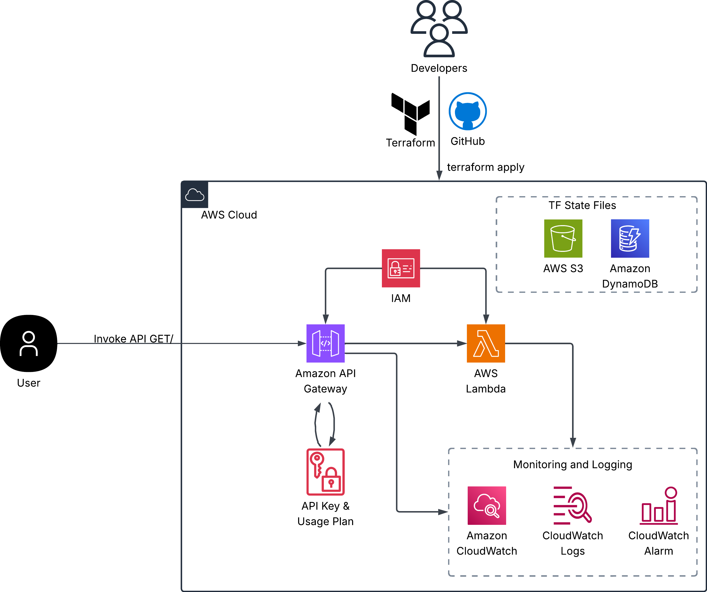
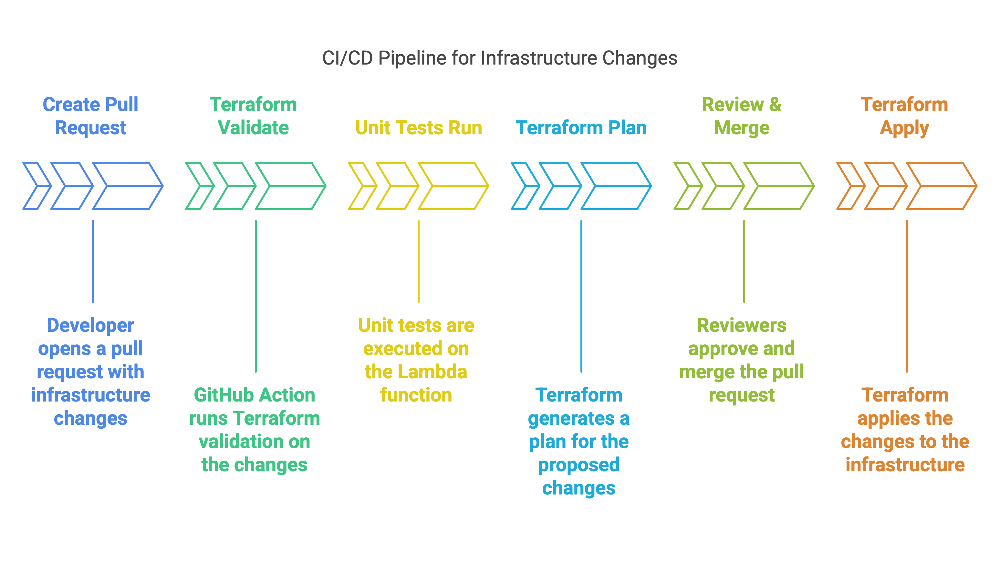

# Checkout Deployment Task

# Overview

This repository holds the Terraform code required to deploy a simple Lambda Function that returns the current time as well as a random fact about cloud computing.

This deployment utilises AWS Lambda, AWS API Gateway, IAM, CloudWatch and S3.

## Architecture



Solution Architecture

## CI/CD Flow

The diagram below depicts the flow of the CI/CD pipeline when triggered.



# Prerequisites

## Authentication

This repository is configured to utilise OIDC to authenticate with AWS for intructions on how to do this please see below:

1. Login to AWS and Navigate to IAM.
2. Select Identity Provider and then OpenID Connect. 
3. For Provider URL enter: *https://token.actions.githubusercontent.com*
4. For Audience enter: sts.amazonaws.com
5. Next, navigate to roles and create a new role, for the trust policy add the code below, replacing the placeholders the value of your github repository and the identity provider you just created: 

```json
{
    "Version": "2012-10-17",
    "Statement": [
        {
            "Effect": "Allow",
            "Principal": {
                "Federated": "<identity provider arn>"
            },
            "Action": "sts:AssumeRoleWithWebIdentity",
            "Condition": {
                "StringLike": {
                    "token.actions.githubusercontent.com:sub": [
                        "repo:<org name>/<repo name>:*"
                    ]
                }
            }
        }
    ]
}
```

6. Add in the below permissions to the role and refine using the IAM Access Analyzer:
```json
{
	"Version": "2012-10-17",
	"Statement": [
		{
			"Sid": "S3Backend",
			"Effect": "Allow",
			"Action": [
				"s3:*"
			],
			"Resource": "*"
		},
		{
			"Sid": "DynamoDBLock",
			"Effect": "Allow",
			"Action": [
				"dynamodb:CreateTable",
				"dynamodb:DescribeTable",
				"dynamodb:UpdateTable",
				"dynamodb:DeleteTable",
				"dynamodb:PutItem",
				"dynamodb:GetItem",
				"dynamodb:DeleteItem"
			],
			"Resource": "*"
		},
		{
			"Sid": "LambdaManagement",
			"Effect": "Allow",
			"Action": [
				"lambda:*"
			],
			"Resource": "*"
		},
		{
			"Sid": "APIGatewayManagement",
			"Effect": "Allow",
			"Action": [
				"apigateway:*"
			],
			"Resource": "*"
		},
		{
			"Sid": "CloudWatchLogs",
			"Effect": "Allow",
			"Action": [
				"logs:*"
			],
			"Resource": "*"
		},
		{
			"Sid": "CloudWatchAlarms",
			"Effect": "Allow",
			"Action": [
				"cloudwatch:*"
			],
			"Resource": "*"
		},
		{
			"Sid": "IAMForRoles",
			"Effect": "Allow",
			"Action": [
				"iam:*"
			],
			"Resource": "*"
		}
	]
}
```
 
7. Take note of the role arn as we will need it to configure our GH action.

## Terraform State

To securely store out state we will utlise AWS S3 for our deployment with dynamodb for state locking. You will need to access the AWS cloud-shell and run the commands below to set these up.

1. AWS S3 creation: 

```json
aws s3api create-bucket \
  --bucket <bucketname> \
  --region eu-west-2 \
  --create-bucket-configuration LocationConstraint=eu-west-2 && \
aws s3api put-bucket-versioning \
  --bucket <bucketname> \
  --versioning-configuration Status=Enabled && \
aws s3api put-bucket-encryption \
  --bucket <bucketname> \
  --server-side-encryption-configuration '{
    "Rules":[
      {
        "ApplyServerSideEncryptionByDefault":{
          "SSEAlgorithm":"AES256"
        }
      }
    ]
  }'
```

1. DynamoDB Table: 

```json

aws dynamodb create-table \
  --table-name terraform-state-lock \
  --attribute-definitions AttributeName=LockID,AttributeType=S \
  --key-schema AttributeName=LockID,KeyType=HASH \
  --billing-mode PAY_PER_REQUEST \
  --region eu-west-2
```

# Repository Configuration

Now that you have successfully created the PreRequisites for our Serverless Application we can configure our GitHub Repository so we can successfully deploy to AWS.

There are two Github Action Secrets that our Github Action rely on to deploy to AWS, those being AWSROLE and AWS_REGION. These can be created in your repositories settings.

1. For AWSROLE the value should be the ARN of the role we created in the Authentication section and for 
2. For AWS_REGION it should be the region we are deploying into. In this instance eu-west-2.
3. In our terraform code ensure to update the backend configuration in the [terraform.tf](http://terraform.tf) file with the S3 bucket name and Dynamodb name.

# Deployment Instructions

Now that we have run through our pre-requisites we are ready to deploy our application. The application configured in this repository has been created to return the current time as well as a random fact about cloud computing. 

1. Create and checkout to a new branch.
2. Configure the values in the infra/main.tf file as desired.
3. Push the branch back up to GitHub. 
4. Create a new pull request to merge your new branch to main. 
5.  Once the tests have passed as outlined in the CI/CD flow section you can merge your branch to main and your serverless application will be deployed to AWS.

# Local Development

If you require to deploy this application from a local machine you can follow the steps below:

1. Ensure you clone the code to a directory locally. 
2. Since we used OIDC in GitHub we will need to run the following command: `*aws configure*` and configure your AWS Access Keys against it. You must ensure that the keys of the user or service account you use have the necessary permissions you need to deploy the stack and follow the principle of least privilege.
3. Once you have configured your aws access you can cd into the infra directory, here you can run your terraform commands like init, validate, fmt, plan and apply. Since are using a remote backend we don’t need any further configuration.
4. Any state operations you need to take can be carried out locally as well.
5. To test our lambda function prior to deploying you can also follow the steps below: 
6. Run the code below to cd to the lambda function and create a python venv: 

 

```bash
cd src/my_lambda
python3 -m venv .venv && source .venv/bin/activate
```

1. Next, run the handler directly with the following command:

```bash
python -c 'import checkout_lambda; print(checkout_lambda.lambda_handler({}, None))'
```

1. Finally run the tests with the command below:

```bash
cd tests
PYTHONPATH=../src/my_lambda pytest test_lambda.py
```

# Design Choices

### Modularised Terraform Code

Creating seperate modules for the API Gateway and Lambda functions abstracts much of the complications away from our main terraform file and allows the user to focus on the variables they need to supply to deploy the application rather than the intricacies of the resource dependencies.

### AWS Authentication and State Management

This solution utilises AWS S3 for a remote backend along with DynamoDB for state locking. This allows secure storage of our state file while ensuring parallel jobs cannot take place potentially corrupting the deployment.

By using the remote backend it also ensures multiple users can work on the application whilst some may work locally and others may push their changes through GitHub.

OIDC has been used for authentication with AWS ensuring we are not using long lived credentials or credentials that rely on manual rotation.  

### GitHub Actions & CI/CD

Once a pull request is crated GitHub Actions will kick off a number of steps as outlined in the CI/CD flow section. The terraform plan can be reviewed in the GitHub actions run and once reviewed only a merge of the branch to the main branch will trigger an apply. 

A seperate GitHub action to destroy the infrastructure also exists. Before manually running this step the user will need to type in DESTROY as a safe guard against deleting the infrastructure accidentally.

Lambda Unit tests have been created to ensure the validity of the response from the lambda function, if this does not occur we will see an error during our pull request phase meaning we can fix the issue. 

The GiHub actions will also only trigger on changes to the infra/* files meaning we can ensure only intended changes are released. 

### API Gateway

A REST API Gateway was chosen over HTTP as this allows for the usage of an API Key for authentication. 

A usage plan has also been set up against the API Gateway with throttling and rate limiting in place to ensure requests do not pass the threshold of the API Gateways free tier (1M requests per month) and protects against malicious attacks.

### Lambda Function

For the lambda function I have chosen to use a source file rather than a docker image for simplicity as there are no requirements where we may need to run the function in other environments. Lambda functions using docker images are also more prone to cold start delays and add an additional requirement of an artifact store like AWS ECR.

I have also utilised the AWS Lambda module for simplicity of deployment, by setting the publish value to true we can ensure proper versioning of the lambda function each time we push a change.